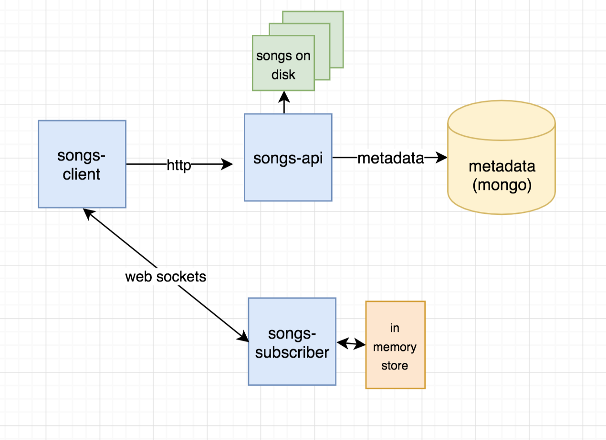

<div align="center">

<h2>Song-App: Web application to play songs</h2>
<p>Song application built using MongoDB, Websockets, React & Bulma</>

  <hr />


<h3>Features: Play songs, Navigate Songs, Get notfiyed when other people listen to your song, and more...</h3>

</div>

<hr/>

## Getting Started

```
git clone https://github.com/boyney123/songs-app.git
```

## Running the application

There are two ways to get the application running.

- Using Docker (recommended)
- Locally

### Using Docker (Recommended)

```
docker-compose build && docker-compose up -d
```

Next populate the database

```
docker-compose exec songs-api npm run populate-database
```

Then go to http://localhost:4000 to see the application 🎉

### Locally

If you would like to run this locally (outside Docker) then you need to:

1. Make sure you have [mongo running on your machine](https://docs.mongodb.com/manual/installation/).
2. Go to `songs-api` and rename `.env-example` to `.env`
3. `npm install && npm start`
4. Go to `songs-subscriber` and run `npm install && npm start`
5. Go to `songs-client` and run `npm install && npm start`

If you would like to populate the database run:

```sh
# Run this inside the songs-api directory
npm run populate-database
```

## Using the application

- You can select a song by clicking on it
- Using the Audio Player controls you can navigate the songs
- If you have other connections (other browsers) play the same songs, the clients will get notified
  - To do this locally, just open up the app across multiple browsers and click on the same songs.
- Pause the songs, clicking pause

---

## About this application

This application is split into three main parts:

1. Song-API (Handle song information)
2. Song-Subscriber (Handle socket connections & shared data)
3. Song-Client (Client application for users)



## Songs-API

The song api was written using Express & MongoDB.

- The songs are stored staticly on disk (for now)
- The metadata for the songs are in MongoDB

### API

#### `GET - /songs`

Returns an array of data for songs. Requires `limit` and `page` query string parameters.

Query String values:

- limit: Number - The number of songs to return
- page: Number - The page to return

Example:

http://localhost:3000/songs?page=1&limit=2 will return 2 songs for the first page. http://localhost:3000/songs?page=2&limit=2 will return the next 2 songs on page 2 and so on...

#### `GET - /download/{file}`

All the `mp3` files are served statically. You can download the `mp3` files using the `/download` API.

Returns the mp3 file.

Example: http://localhost:3000/download/Decision.mp3

All the mp3s that can be downloaded are in the `songs-api/public/songs` directory.

## Song Subscriber

The `song-subscriber` handles connections between client and server. This is used to share song information between users when they connect to the client.

When the client starts and stops songs, events are emitted to the server and the data (in memory for now...) is updated with the current state.

Then all clients are notified of the state changes, and the client works out how many listeners are currently listening to that song.

This uses NodeJS and Socket.io.

## Song-Client

This is the web application that plays songs from the song-library (from the song-api). Requests are made to the server to get the songs and user can play them.

This is the web application built using:

- React
- React Hooks
- useReducer (rather than redux) for state management
  - I believe it might be overkill to use redux here but this is just a POC.
- Jest
- react-testing-library
- socket.io-client

## Assumptions / Choices

- No pages were required (using the pagination functionality)
- In memory data for socket data is fine for now. Could move to database / redis when required.
- Song images are from a random website at the moment. In theory these could be hosted on a CDN and pulled in (size of images are big too, which would be trimmed)
- No tests have been written for the subscriber service at the moment.
- useReducer/Redux seems overkill for this application, most can be done with local state in the Provider components, but for POC that was used.
- Most components have been kept dumb, which does mean the Application holds the business logic. In theory you could scale some of this down to the components, but I wanted to keep them dumb/reuseable for now.
- User can not click on the progress bar for now (song progress bar)
- Songs are not stored/retrieved from network storage (dropbox, drive, s3) yet.
- All services are in this monorepo for now, in reality they would be seperated
